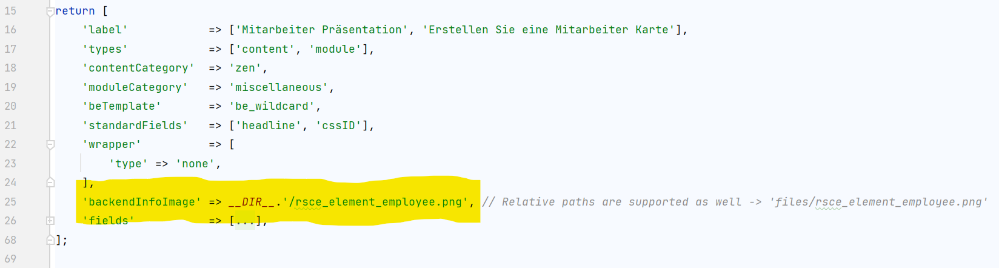

<p align="center"><a href="https://github.com/markocupic"></a></p>

# Contao Rocksolid Custom Element Backend Info Image for Contao CMS

This Plugin extends [madeyourday/contao-rocksolid-custom-elements](https://github.com/madeyourday/contao-rocksolid-custom-elements).
The extension allows you to display a thumbnail beside the rsce element type.


## Image configuration
The image configuration can be made in the config file of your rocksolid custom element.


## Installation

Execute the following command to install the extension:
```bash
composer require markocupic/contao-rsce-backend-info-image
```

## Plugin configuration

The image html markup and the "add_after_regex_pattern" can be customized in your project `config/config.yml`.

```yaml
# config/config.yml
markocupic_contao_rsce_backend_info_image:
 image_markup: '<div class="long widget rsce-backend-info-image"><div class="rsce-backend-info-image-inner"></div></div>'
 add_after_regex_pattern: '/<legend onclick="AjaxRequest\.toggleFieldset\(this,\'([a-z]+)_legend\',\'([a-zA-Z0-9-_]+)\'\)">([a-zA-Z0-9 ]+)<\/legend>/'
```

---
This extension has been sponsored by [kda.studio](https://www.kda.studio/), 63067 Offenbach am Main, Germany
<p align="left"><a href="https://www.kda.studio" title="kda.studio"></a></p>
